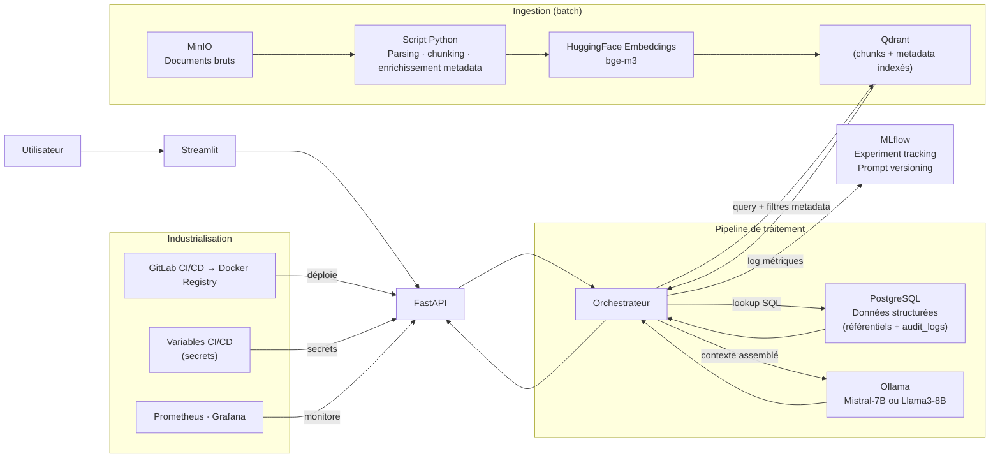

# Cadre LLMOps Open Source — Contexte, Stack, Méthodo, Questions Transverses

## 1. Correspondance GCP → Stack Open Source

Ces projets fil rouge utilisent une stack 100% open source, déployable en local ou sur n'importe quel cloud via Docker Compose. Le tableau suivant établit la correspondance avec les services GCP utilisés dans les projets JEMS.

| Brique fonctionnelle | GCP (projets JEMS) | Open Source (ces projets) |
|---|---|---|
| Stockage objets (documents bruts) | Cloud Storage (GCS) | **MinIO** (port 9000) |
| Base de données relationnelle | BigQuery | **PostgreSQL 15** (port 5432) |
| Recherche vectorielle | Vertex AI Vector Search | **Qdrant** (port 6333) |
| Embeddings | Vertex AI Embeddings (text-embedding-gecko) | **BAAI/bge-m3** via sentence-transformers |
| LLM (génération) | Gemini Pro / Gemini Flash | **Ollama** (Mistral-7B-Instruct ou Llama3-8B, port 11434) |
| API backend | Cloud Run (FastAPI) | **FastAPI** (Docker local) |
| Interface démo | Cloud Run (Streamlit) | **Streamlit** (Docker local) |
| Build & déploiement | Artifact Registry + Cloud Build | **GitLab CI/CD + Docker Registry** |
| Secrets | Secret Manager | **Variables CI/CD GitLab** |
| Monitoring applicatif | Cloud Monitoring + Cloud Logging | **Prometheus + Grafana** (ports 9090/3000) |
| **Experiment tracking (LLMOps)** | _Absent en JEMS_ | **MLflow** (port 5000) |
| **Évaluation LLM (LLMOps)** | _Absent en JEMS_ | **Ragas / DeepEval** |

---

## 2. Ce qui est spécifique LLMOps — Absent des projets classiques

Les projets JEMS produisent un système RAG fonctionnel. Ces projets vont plus loin : ils exigent une **couche LLMOps** explicite, absente des projets data classiques.

### 2.1 Experiment Tracking avec MLflow

Chaque appel LLM tracé = un **run MLflow**. Ce run contient :
- **Paramètres** : nom du modèle (`mistral:7b`), version du prompt, température, `max_tokens`, seuil de similarité Qdrant
- **Métriques** : `faithfulness`, `answer_relevancy`, `context_precision` (Ragas), latence P50/P95, tokens générés
- **Artefacts** : prompt complet (template), réponse générée, contexte récupéré

```python
import mlflow

with mlflow.start_run(experiment_name="support_produit_v2"):
    mlflow.log_param("model", "mistral:7b")
    mlflow.log_param("prompt_version", "v3")
    mlflow.log_param("temperature", 0.1)
    mlflow.log_metric("faithfulness", 0.87)
    mlflow.log_metric("answer_relevancy", 0.82)
    mlflow.log_metric("latency_ms", 1240)
    mlflow.log_artifact("prompt_template_v3.txt")
```

### 2.2 Prompt Versioning

Chaque prompt est un **artefact versionné** dans MLflow, pas un string hardcodé. La convention :
- `v1` : prompt initial (baseline)
- `v2` : prompt avec instructions de format de réponse
- `v3` : prompt avec few-shot examples

On peut ainsi **comparer deux versions de prompt** sur exactement les mêmes cas de test du fichier `eval_*.csv` et choisir objectivement la meilleure.

### 2.3 Pipeline d'Évaluation Automatisé (Ragas)

Chaque projet dispose d'un fichier `eval_*.csv` servant de **ground truth**. Le pipeline :

```
eval_*.csv → requête au système → réponse + contexte récupéré → Ragas → métriques
```

Métriques Ragas à mesurer :
- **`faithfulness`** : la réponse est-elle fidèle au contexte récupéré ? (0 à 1)
- **`answer_relevancy`** : la réponse répond-elle à la question ? (0 à 1)
- **`context_precision`** : les chunks récupérés sont-ils pertinents ? (0 à 1)

Seuils cibles recommandés : `faithfulness > 0.80`, `answer_relevancy > 0.75`, `context_precision > 0.70`.

### 2.4 Drift Monitoring

Le drift sur un système LLM peut être de deux types :
- **Drift de données** : les nouvelles questions posées s'éloignent de la distribution d'entraînement
- **Drift de performance** : les scores Ragas baissent sur une fenêtre glissante de requêtes récentes

Implémentation minimale attendue : calcul des métriques Ragas sur une fenêtre glissante de 50 requêtes, exposition via Prometheus, alerte Grafana si `faithfulness < 0.75`.

### 2.5 Comparaison de Modèles

La stack Ollama permet de faire tourner **Mistral-7B** et **Llama3-8B** en parallèle. La démarche attendue :
1. Créer deux expériences MLflow distinctes (`exp_mistral` et `exp_llama3`)
2. Évaluer les deux modèles sur le même fichier `eval_*.csv`
3. Comparer les métriques Ragas et la latence
4. Justifier le choix du modèle retenu pour le MVP

---

## 3. Architecture Générique Open Source



---

## 4. Philosophie Cadrage — Le Use Case N'est Pas Imposé

Contrairement aux projets JEMS où le domaine et les questions-types sont prescrits, ces projets ont un **cahier des charges intentionnellement ouvert**. Chaque projet décrit :
- Un **domaine métier** (support produit, conformité, formation)
- Des **données disponibles** (corpus documentaire + tables SQL)
- Des **capacités attendues** (liste non exhaustive)

Il ne prescrit **pas** "votre MVP doit répondre à telle question". Les apprenants doivent, en **Phase 1 (Sprint 1, Jours 1-2)**, choisir leur use case MVP, définir le périmètre, identifier les critères de succès.

**La qualité du cadrage est évaluée au même titre que l'exécution technique** (15 points sur 100 dans la grille).

Un bon cadrage répond à :
- Quel problème métier précis résout-on ?
- Pour quel utilisateur ?
- Comment mesure-t-on le succès ?
- Qu'est-ce qu'on laisse délibérément hors périmètre ?

---

## 5. Questions Transverses Jury

### Questions héritées du cadre JEMS (posées à tous les groupes)

1. Quel est votre MVP exact, et qu'avez-vous délibérément laissé hors périmètre ?
2. Qu'avez-vous choisi de vectoriser, et pourquoi ?
3. Quelles données avez-vous gardées hors index vectoriel (en SQL pur) ?
4. Quel est votre schéma de métadonnées sur les chunks Qdrant ?
5. Comment réindexez-vous le corpus si un document est mis à jour ?
6. Comment gérez-vous les erreurs de parsing et les documents rejetés ?
7. Quels sont vos 3 principaux risques techniques ou fonctionnels ?
8. Quelles métriques avez-vous mesurées pour prouver la qualité ?
9. Quel est le coût unitaire approximatif d'une requête (mémoire, temps de réponse) ?
10. Si vous aviez 2 semaines de plus, que feriez-vous en priorité ?

### Questions LLMOps spécifiques à ces projets

**Q11 — Comment versionnez-vous vos prompts ?**
> Bonne réponse attendue : "Chaque prompt est enregistré comme un run MLflow avec ses paramètres (template, température, max_tokens) et ses métriques d'évaluation (faithfulness, answer_relevancy sur le jeu de test). On peut comparer deux versions de prompt sur les mêmes cas de test et choisir la meilleure objectivement."

**Q12 — Comment comparez-vous deux modèles LLM (ex: Mistral vs Llama3) ?**
> Bonne réponse attendue : "On crée deux expériences MLflow séparées, on évalue les deux modèles sur eval_*.csv avec Ragas, on compare faithfulness et answer_relevancy. La décision est basée sur les métriques, pas sur une impression subjective lors d'un test manuel."

**Q13 — Qu'est-ce qui déclencherait une alerte de drift dans votre système ?**
> Bonne réponse attendue : "On monitore la distribution des scores Ragas sur une fenêtre glissante de 7 jours. Si la moyenne de faithfulness descend sous 0.75 (vs baseline de 0.85), une alerte Grafana se déclenche. On surveille aussi la latence P95 et le taux d'erreur API via Prometheus."

---

## 6. Ce qui Différencie les Groupes

### Groupe insuffisant
- Présente un chatbot sans experiment tracking
- N'a pas de fichier d'évaluation renseigné
- Confond "ça marche en démo" avec "la qualité est prouvée"
- Ne peut pas justifier le choix du modèle LLM

### Groupe moyen
- A MLflow mais ne l'utilise que pour loguer la latence
- A Ragas mais n'a évalué que 2-3 cas
- A un prompt fixé en dur dans le code
- A fait une démo mais sans sources citées

### Groupe bon
- Phase 1 solide : use case clairement défini, périmètre assumé
- Architecture hybride justifiée (quoi en vectoriel, quoi en SQL)
- MLflow utilisé pour comparer au moins 2 versions de prompt
- Pipeline Ragas automatisé sur tout eval_*.csv
- Drift monitoring configuré avec seuil défini

### Groupe excellent
- Comparaison de modèles avec décision justifiée par métriques
- Prompt versioning avec amélioration mesurable entre v1 et v3
- Réponses sourcées avec chunks cités + table SQL référencée
- Propose des axes d'amélioration concrets basés sur les cas échoués
- Sait expliquer pourquoi certains cas sont difficiles (ambigu, hors corpus)
