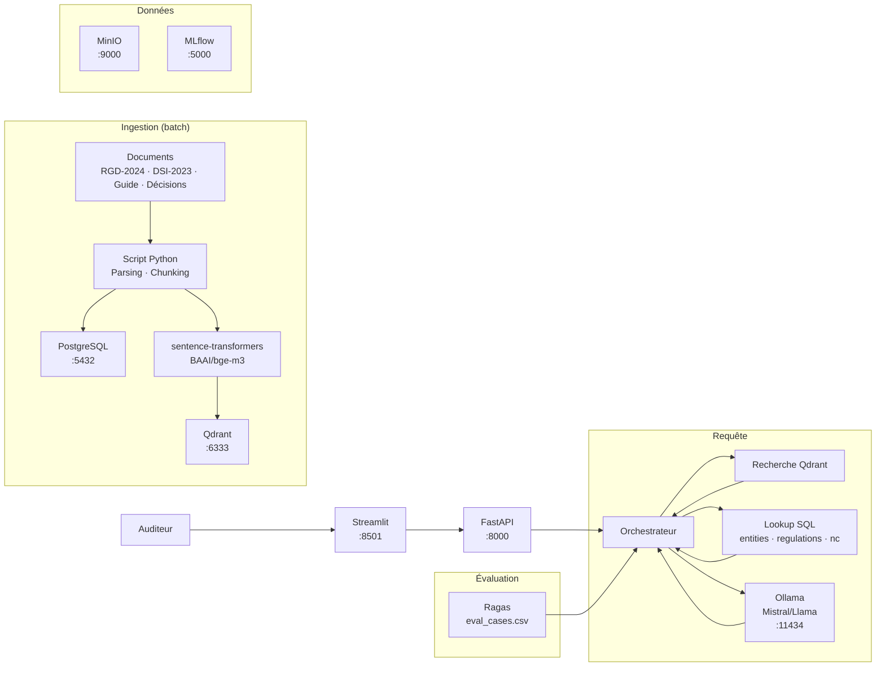

# Projet Conformité Réglementaire — Guide de soutenance

## Ce que fait ce projet (en clair)

Un auditeur doit analyser un dossier de conformité. Aujourd'hui il cherche dans les textes réglementaires, croise avec le profil de l'entité, identifie les écarts. Avec ce système, il soumet un document et reçoit : "Cette entité est soumise à RGD-2024 + DSI-2023. Analyse : 2 non-conformités identifiées — Art.12 (registre) et Art.18 (DPO). Source : RGD-2024 Art.12/18."

**Ce n'est pas un chatbot.** C'est un copilote d'audit qui combine les textes réglementaires (vectorisés) et les référentiels métier (SQL).

---

## Cas d'usage possibles

| Cas d'usage | Ce qu'il active |
|----------|-----------------|
| "Analyser un document et détecter les écarts réglementaires" | Règles SQL (seuils, délais) + RAG pour articles applicables |
| "Planifier les contrôles prioritaires pour une entité" | SQL (scores, dates, non-conformités ouvertes) + RAG contexte |
| "Répondre à une question réglementaire en citant les textes" | RAG pur sur corpus réglementaire + lookup SQL entité |

### Cas d'usage MVP conseillé

> "Une entité soumet un document d'auto-évaluation. Le système analyse et identifie les écarts réglementaires potentiels avec les articles applicables."

**Cas concret dans le dataset :**
> "Notre entreprise conserve les données clients pendant 10 ans. Nous n'avons pas de DPO. Nous traitons les données de 800 clients."

---

## Phases projet (3 sprints × 5 jours)

| Sprint | Jours | Objectif | Livrable attendu |
|--------|-------|----------|-------------------|
| **Sprint 1** | J1–J5 | Socle data | Schéma SQL défini, textes réglementaires parsés, index vectoriel opérationnel |
| **Sprint 2** | J6–J10 | Démo de bout en bout | Orchestrateur RAG + SQL opérationnel, détection NC sur cas test |
| **Sprint 3** | J11–J15 | Évaluation + industrialisation | Évaluation sur eval_cases.csv, MLflow, surveillance de dérive, démo live |

**Critère de validation du sprint 2 (Conformité) :** la soumission "données 10 ans, pas de DPO, 800 clients" renvoie : non-conformités (Art.12, Art.18), articles applicables, sévérité, échéance.

---

## Architecture cible (open source)



---

## LLMOps — Ce qui est attendu

### Suivi d'expérimentation (MLflow)

| Élément | Description |
|---------|-------------|
| Paramètres suivis | modèle, température, chunk_size, prompt_version |
| Métriques | latency_ms, faithfulness, answer_relevancy |
| Artefacts | prompt versionné, réponse brute |

### Versionnement des prompts

| prompt_version | model | eval_set | faithfulness | answer_relevancy |
|----------------|-------|----------|--------------|------------------|
| v1 | mistral-7b | eval_cases.csv | 0.80 | 0.75 |
| v2 | mistral-7b | eval_cases.csv | 0.85 | 0.82 |

### Évaluation Ragas

Métriques obligatoires :
- **Faithfulness** : réponse cohérente avec le contexte réglementaire ?
- **Answer Relevancy** : répond à la question ?
- **Context Precision** : bons articles en premier ?

---

## IA Act / RGPD / Sécurité

### Minimum MVP attendu

| Exigence | Mise en œuvre |
|----------|---------------|
| Authentification API | API key — qui peut interroger ? |
| Sources citées | Chaque réponse cite les articles réglementaires |
| Logs de requêtes | `audit_logs` — qui a demandé quoi, quand |
| Refus propre | "Information non disponible" plutôt qu'halluciné |
| Secrets protégés | Clés Ollama en variable d'environnement |

### Ce projet et les données

Ce projet manipule des **données d'entités** (nom, secteur, score). Les données de démo sont fictives (ENT-001, ENT-003, etc.). Les logs ne stockent pas d'informations sensibles.

---

## Données : vectorisé vs structuré

**À vectoriser :**
- `reglement_rgd_2024.md`
- `directive_securite_si.md`
- `guide_interpretation.md`
- `decisions_reference.md`

**À garder en SQL :**
- `regulations.csv` — catalogue des règlements
- `entities.csv` — registre des entités avec applicable_regulations
- `non_conformities.csv` — base des NC connues
- `controls.csv` — historique des contrôles
- `risk_register.csv` — registre des risques

---

## Tables structurées attendues

```sql
-- Référentiels réglementaires
regulations(regulation_id, code, domain, effective_date, scope, criticality)
entities(entity_id, name, sector, size_employees, applicable_regulations, 
         compliance_score, last_audit_date)

-- Non-conformités
non_conformities(nc_id, entity_id, regulation_id, article_ref, description,
                 severity, detection_date, deadline, status, remediation_plan)

-- Contrôles
controls(control_id, entity_id, regulation_id, title, planned_date, 
         completed_date, status, result)

-- Risques
risk_register(risk_id, entity_id, risk_category, risk_description, 
              likelihood, impact, status)

-- Métadonnées corpus
documents(doc_id, path, title, regulation_id, doc_type, version, updated_at)
document_chunks(chunk_id, doc_id, chunk_order, text, article_ref, regulation_id)

-- Traçabilité
audit_logs(request_id, user_id, timestamp, question, nc_detected,
           articles_cited, response_length)
```

---

## Logique métier attendue

1. **Identifier** les règlements applicables (lookup SQL sur entity)
2. **Extraire** les éléments clés du document soumis
3. **RAG** sur les articles réglementaires applicables
4. **Appliquer** les règles SQL (seuils, délais) pour chaque regulation
5. **Détecter** les non-conformités potentielles
6. **Assigner** une sévérité selon les règles
7. **Assembler** réponse structurée avec articles cités

---

## Réponse attendue type

1. Règlements applicables identifiés
2. Non-conformités détectées (avec ID et article)
3. Sévérité assignée
4. Échéance de mise en conformité
5. Articles réglementaires cités
6. Limites ou informations manquantes

---

## Questions à poser + exemples de bonnes réponses

**Comment détectez-vous qu'une entité est soumise à un règlement ?**
> Bonne réponse : "On lookup le champ applicable_regulations dans entities.csv. C'est une liste de regulation_id. On filtre les articles applicables pour ce match."

**Comment gérez-vous la validité temporelle des règlements ?**
> Bonne réponse : "On compare la date effective du règlement avec la date actuelle. Si un règlement est en revision_date, on utilise la nouvelle version. Les entités ont un délai de mise en conformité."

**Quelles données avez-vous vectorisées vs gardées en SQL ?**
> Bonne réponse : "On a vectorisé les textes réglementaires (RGD, DSI, guide, décisions). On n'a pas vectorisé les entités et NC : lookup SQL plus efficace pour les règles (seuils, dates)."

**Questions discriminantes :**
- Comment gérez-vous les textes qui se contredisent entre versions ?
- Comment prouvez-vous que la détection NC n'est pas hallucinée ?
- Comment priorisez-vous les contrôles pour une entité ?

---

## Démos recommandées

- **Démo 1** : Analyse "10 ans conservation, pas de DPO, 800 clients" → NC détectées
- **Démo 2** : Analyse "pentest 26 mois, plan non testé" → NC cybersécurité
- **Démo 3** : Question réglementaire "quel est le RTO pour 1200 employés ?" → RAG seul

---

## KPIs cibles

| Métrique | Cible | Alerte |
|----------|-------|--------|
| Latence API P95 | < 2s | > 5s |
| Précision détection NC | > 85% | < 70% |
| Taux de citations correctes | > 90% | < 75% |
| Classification regulation | > 90% | < 80% |

---

## Checklist soutenance

- [ ] Cas d'usage MVP expliqué en 30 secondes
- [ ] Séparation vectoriel / SQL justifiée
- [ ] Schéma de métadonnées présenté
- [ ] Réponse avec sources montrée en démo live
- [ ] Cas limites illustrés (multi-règlements, nouvelle entité)
- [ ] Suivi MLflow démontré
- [ ] Évaluation Ragas sur eval_cases.csv présentée
- [ ] `audit_logs` mentionné
- [ ] Limites connues mentionnées
