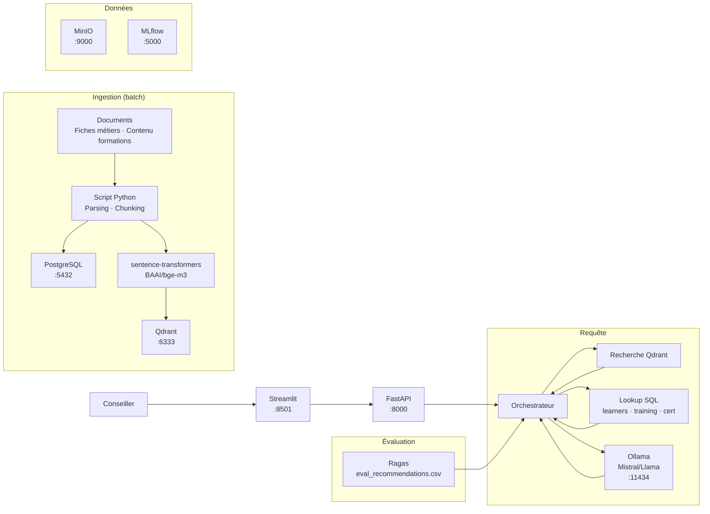

# Projet Parcours Apprenant — Guide de soutenance

## Ce que fait ce projet (en clair)

Un conseiller pédagogique doit construire un parcours pour un apprenant. Aujourd'hui il analyse le profil, cherche dans le catalogue, construit le parcours manuellement. Avec ce système, il donne le profil et reçoit : "Voici le parcours recommandé : TR-001 + TR-002 + TR-012 + TR-018 (112h). Première formation : Python pour la Data. Certification cible : Certified Data Engineer. Source : fiche_data_engineering.md, training_catalog."

**Ce n'est pas un chatbot.** C'est un copilote d'orientation qui combine les fiches métiers (vectorisées) et les référentiels métier (SQL).

---

## Cas d'usage possibles

| Cas d'usage | Ce qu'il active |
|----------|-----------------|
| "Recommander un parcours personnalisé pour un apprenant donné" | Extraction profil SQL + scoring vs prérequis + RAG fiches métiers |
| "Vérifier si un apprenant est prêt pour une certification" | SQL lookup prérequis cert + scoring compétences + RAG fiche cert |
| "Identifier les lacunes d'un profil vs un métier cible" | SQL gap analysis + RAG fiches métiers pour contextualiser |

### Cas d'usage MVP conseillé

> "Un apprenant donne son profil (rôle actuel, compétences, objectif). Le système recommande un parcours de formations."

**Cas concret dans le dataset :**
> "Je suis développeuse Python, j'ai fait TR-001, mon objectif : devenir Data Engineer."

---

## Phases projet (3 sprints × 5 jours)

| Sprint | Jours | Objectif | Livrable attendu |
|--------|-------|----------|-------------------|
| **Sprint 1** | J1–J5 | Socle data | Schéma SQL défini, fiches métiers parsées, index vectoriel opérationnel |
| **Sprint 2** | J6–J10 | Démo de bout en bout | Scoring SQL + RAG opérationnel, recommandation sur cas test |
| **Sprint 3** | J11–J15 | Évaluation + industrialisation | Évaluation sur eval_recommendations.csv, MLflow, démo live |

**Critère de validation du sprint 2 (Parcours) :** le profil "développeuse Python, TR-001, objectif DE" renvoie : parcours recommandé (formations), durée totale, première formation, certification cible.

---

## Architecture cible (open source)



---

## LLMOps — Ce qui est attendu

### Suivi d'expérimentation (MLflow)

| Élément | Description |
|---------|-------------|
| Paramètres suivis | modèle, température, chunk_size, prompt_version |
| Métriques | latency_ms, faithfulness, answer_relevancy |
| Artefacts | prompt versionné, réponse brute |

### Versionnement des prompts

| prompt_version | model | eval_set | faithfulness | answer_relevancy |
|----------------|-------|----------|--------------|------------------|
| v1 | mistral-7b | eval_recommendations.csv | 0.78 | 0.75 |
| v2 | mistral-7b | eval_recommendations.csv | 0.85 | 0.82 |

### Évaluation Ragas

Métriques obligatoires :
- **Faithfulness** : cohérence avec les fiches métiers ?
- **Answer Relevancy** : répond à la demande de parcours ?
- **Context Precision** : bonnes infos en premier ?

---

## IA Act / RGPD / Sécurité

### Minimum MVP attendu

| Exigence | Mise en œuvre |
|----------|---------------|
| Authentification API | API key — qui peut interroger ? |
| Sources citées | Chaque recommandation cite les sources |
| Logs de requêtes | `audit_logs` — qui a demandé quoi, quand |
| Refus propre | "Information non disponible" plutôt qu'halluciné |
| Secrets protégés | Clés Ollama en variable d'environnement |

### Ce projet et les données

Ce projet manipule des **profils d'apprenants** (nom, compétence, objectif). Les données de démo sont fictives (LRN-001, LRN-003, etc.). Les logs ne stockent pas d'informations sensibles.

---

## Données : vectorisé vs structuré

**À vectoriser :**
- `fiche_data_engineering.md`
- `fiche_mlops.md`
- `fiche_llm_engineer.md`
- `fiche_data_scientist.md`
- `metiers_cibles.md`

**À garder en SQL :**
- `training_catalog.csv` — catalogue des formations
- `learners.csv` — profils apprenants
- `certifications.csv` — catalogue des certifs
- `prerequisites.csv` — prérequis par formation
- `assessments.csv` — historiques des évaluations

---

## Tables structurées attendues

```sql
-- Référentiels pédagogiques
training_catalog(training_id, title, domain, level, duration_hours, format,
                skills_acquired, price_eur, active)
certifications(cert_id, name, domain, required_skills, recommended_trainings,
                validity_years, market_recognition, level)
prerequisites(training_id, prerequisite_skill, required_level, is_mandatory)

-- Apprenants
learners(learner_id, name, current_role, years_experience, current_skills,
         learning_goal, availability_hours_week, completed_trainings,
         target_certification)

-- Évaluations
assessments(assessment_id, learner_id, training_id, assessment_date,
            score, passed)

-- Métadonnées corpus
documents(doc_id, path, title, doc_type, target_metier, version, updated_at)
document_chunks(chunk_id, doc_id, chunk_order, text, skills_mentioned, target_metier)

-- Traçabilité
audit_logs(request_id, user_id, timestamp, learner_profile, recommendations,
           first_training, response_length)
```

---

## Logique métier attendue

1. **Extraire** le profil depuis learners.csv (ou input ad hoc)
2. **Identifier** l'objectif (target_certification ou learning_goal)
3. **Lookup SQL** certifications pour les compétences requises
4. **Comparer** compétences actuelles vs requises (gap analysis)
5. **RAG** sur les fiches métiers pour contextualiser
6. **Scorer** les formations selon prérequis et objectif
7. **Assembler** parcours recommandé + durée + première formation

---

## Réponse attendue type

1. Profil détecté (rôle actuel, compétences, objectif)
2. Certification cible proposée
3. Parcours recommandé (liste des formations)
4. Durée totale estimée
5. Première formation recommandée
6. Compétences manquantes identifiées
7. Sources citées (fiches métiers)

---

## Questions à poser + exemples de bonnes réponses

**Comment calculez-vous le score d'un parcours ?**
> Bonne réponse : "On compare les compétences requises (cert.required_skills) avec les compétences actuelles (learner.current_skills). On filtre les formations qui comblent les manques. On trie par durée et prérequis."

**Pourquoi les fiches métiers en vectoriel et pas en SQL ?**
> Bonne réponse : "Les fiches contiennent du texte libre (conseils, description de métier) qu'on veut pouvoir contextualiser. Les données structurées (skills, durée) restent en SQL."

**Comment gérez-vous les prérequis entre formations ?**
> Bonne réponse : "On lookup prerequisites.csv. Si formation A a prérequis 'python_basics intermediate' et que l'apprenant ne l'a pas, on ajoute la formation correspondante en prérequis du parcours."

**Questions discriminantes :**
- Comment prouvez-vous que le parcours est cohérent avec l'objectif ?
- Comment gérez-vous un profil avec objectif flou ?
- Comment évaluez-vous la qualité de la recommandation ?

---

## Démos recommandées

- **Démo 1** : LRN-001 (Python, objectif DE) → parcours DE
- **Démo 2** : LRN-007 (ML Engineer, objectif LLM) → parcours LLM
- **Démo 3** : LRN-012 (DS Senior, objectif MLOps) → parcours court MLOps

---

## KPIs cibles

| Métrique | Cible | Alerte |
|----------|-------|--------|
| Latence API P95 | < 2s | > 5s |
| Précision recommandation | > 85% | < 70% |
| Taux de citations correctes | > 90% | < 75% |
| Score cohérence parcours | > 80% | < 65% |

---

## Checklist soutenance

- [ ] Cas d'usage MVP expliqué en 30 secondes
- [ ] Séparation vectoriel / SQL justifiée
- [ ] Schéma de métadonnées présenté
- [ ] Réponse avec sources montrée en démo live
- [ ] Cas limites illustrés (profil incomplet, objectif flou)
- [ ] Suivi MLflow démontré
- [ ] Évaluation Ragas sur eval_recommendations.csv présentée
- [ ] `audit_logs` mentionné
- [ ] Limites connues mentionnées
