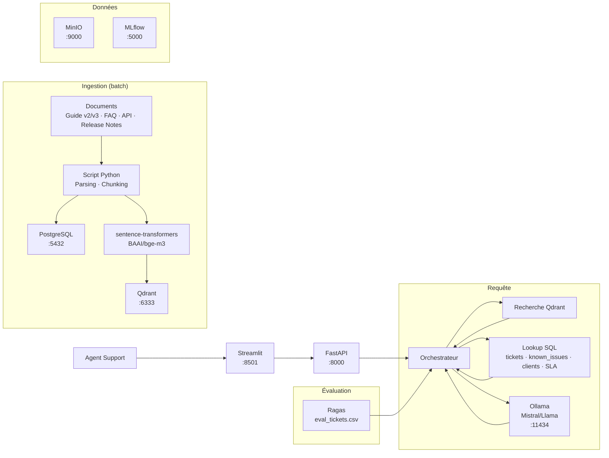

# Projet Support Produit — Guide de soutenance

## Ce que fait ce projet (en clair)

Un agent support Nexus Platform reçoit un ticket d'incident. Aujourd'hui il cherche dans la doc, consulte la base de known issues, vérifie la version du client. Avec ce système, il décrit le problème et reçoit : "Ce problème est connu (KI-007), affecte les versions 3.0.0 et 3.1.0, contournement : utiliser `from nexus.connectors import DataConnector`, corrigé en 3.1.1. Votre client CLI-003 est en version 3.1.0, il peut mettre à jour."

**Ce n'est pas un chatbot.** C'est un copilote support qui combine la documentation technique (vectorisée) et les référentiels métier (SQL).

---

## Cas d'usage possibles

| Cas d'usage | Ce qu'il active |
|----------|-----------------|
| "Classifier un ticket et proposer une résolution documentée" | Classification LLM + RAG docs + lookup known_issues SQL |
| "Vérifier la conformité SLA d'un ticket en cours" | SQL lookup (client tier + sla_matrix + dates) + réponse structurée |
| "Détecter si un ticket correspond à une issue connue ou est un nouveau problème" | RAG known_issues + matching SQL + flag "nouveau problème" |

### Cas d'usage MVP conseillé

> "Un client signale un problème. Le système identifie si c'est une issue connue, propose le contournement, vérifie la version du client et suggère la mise à jour si disponible."

**Cas concret dans le dataset :**
> "Client CLI-003 en version 3.1.0 : ImportError cannot import name DataConnector"

---

## Phases projet (3 sprints × 5 jours)

| Sprint | Jours | Objectif | Livrable attendu |
|--------|-------|----------|-------------------|
| **Sprint 1** | J1–J5 | Socle data | Schéma SQL défini, documents parsés/chunkés, known_issues chargé, index vectoriel opérationnel |
| **Sprint 2** | J6–J10 | Démo de bout en bout | Orchestrateur RAG + SQL opérationnel, endpoint `/ask`, réponse avec sources sur cas principal |
| **Sprint 3** | J11–J15 | Évaluation + industrialisation | Évaluation sur eval_tickets.csv, suivi MLflow, surveillance de dérive, démo live |

**Critère de validation du sprint 2 (Support Produit) :** la question "ImportError DataConnector sur client version 3.1.0" renvoie : issue connue (KI-007), contournement, version corrigée, suggestion de mise à jour.

---

## Architecture cible (open source)



---

## LLMOps — Ce qui est attendu

### Suivi d'expérimentation (MLflow)

| Élément | Description |
|---------|-------------|
| Paramètres suivis | modèle, température, chunk_size, prompt_version |
| Métriques | latency_ms, tokens, faithfulness, answer_relevancy |
| Artefacts | prompt versionné, réponse brute |

### Versionnement des prompts

| prompt_version | model | eval_set | faithfulness | answer_relevancy |
|----------------|-------|----------|--------------|------------------|
| v1 | mistral-7b | eval_tickets.csv | 0.82 | 0.78 |
| v2 | mistral-7b | eval_tickets.csv | 0.88 | 0.84 |

### Évaluation Ragas

Métriques obligatoires :
- **Faithfulness** : réponse cohérente avec le contexte ?
- **Answer Relevancy** : répond à la question ?
- **Context Precision** : bons extraits en premier ?

---

## IA Act / RGPD / Sécurité

### Minimum MVP attendu

| Exigence | Mise en œuvre |
|----------|---------------|
| Authentification API | API key — qui peut interroger ? |
| Sources citées | Chaque réponse cite les documents utilisés |
| Logs de requêtes | `audit_logs` — qui a demandé quoi, quand |
| Refus propre | "Information non disponible" plutôt qu'halluciné |
| Secrets protégés | Clés Ollama en variable d'environnement |

### Ce projet et les données

Ce projet manipule des **données client** (nom, version, tier SLA). Les données de démo sont fictives (CLI-001, CLI-003, etc.). Les logs ne stockent pas d'informations personnelles en clair.

---

## Données : vectorisé vs structuré

**À vectoriser :**
- `guide_installation_v3.md`, `guide_installation_v2.md`
- `faq_erreurs_frequentes.md`
- `api_reference.md`
- `release_notes_v3.md`

**À garder en SQL :**
- `tickets.csv` — historique des tickets
- `known_issues.csv` — base de problèmes connus
- `clients.csv` — catalogue clients avec version, tier
- `sla_matrix.csv` — temps de réponse par tier/sévérité
- `product_versions.csv` — versions dispo

---

## Tables structurées attendues

```sql
-- Référentiels métier
known_issues(issue_id, affected_versions, component, title, symptoms, 
             workaround, fixed_in_version, severity)
clients(client_id, company_name, product_version, sla_tier, industry)
sla_matrix(sla_tier, severity, first_response_hours, resolution_target_hours)
product_versions(version_id, version_name, status, lts, breaking_changes)

-- Historique
tickets(ticket_id, date, client_id, product_version, title, description,
        severity, status, category, resolution_id)

-- Métadonnées corpus
documents(doc_id, path, title, doc_type, version, updated_at)
document_chunks(chunk_id, doc_id, chunk_order, text, component, tags)

-- Traçabilité
audit_logs(request_id, user_id, timestamp, question, category_detected,
           sources_used, response_length)
```

---

## Logique métier attendue

1. **Classifier** la demande : bug / question / performance / migration
2. **Extraire** : version concernée, symptoms depuis la question
3. **Retrieval** filtré sur les documents techniques (FAQ, guides, release notes)
4. **Lookup SQL** `known_issues` sur symptoms → vérifier si issue connue
5. **Lookup SQL** `clients` et `product_versions` pour la version du client
6. **Vérifier** si contournement disponible, si mise à jour existe
7. **Assembler** réponse structurée et loguer

---

## Réponse attendue type

1. Classification du ticket (bug, question, etc.)
2. Issue connue ? (ID + description)
3. Contournement proposé
4. Version avec fix si disponible
5. Suggestion mise à jour selon le client
6. Sources citées
7. Limites ou informations manquantes

---

## Questions à poser + exemples de bonnes réponses

**Comment détectez-vous si un ticket correspond à une issue connue ?**
> Bonne réponse : "On récupère les symptoms de la question, on les cherche dans known_issues via matching sémantique (RAG) ou mot-clé. On vérifie la version du client. Si match, on retourne KI-XXX avec workaround."

**Quelles données avez-vous vectorisées vs gardées en SQL ?**
> Bonne réponse : "On a vectorisé la documentation technique (guides, FAQ, release notes). On n'a pas vectorisé known_issues : lookup SQL avec filtres (version, component) plus efficace que similarité sémantique."

**Comment gérez-vous les versions client pour suggérer une mise à jour ?**
> Bonne réponse : "On joint clients.product_version avec product_versions pour vérifier status (current, supported, maintenance_only, end_of_life). Si version obsolète, on suggère upgrade vers 'current'."

**Questions discriminantes :**
- Pourquoi known_issues en SQL et pas en vectoriel ?
- Comment gérez-vous les cas où le contournement ne fonctionne pas ?
- Comment prouvez-vous que la réponse n'est pas hallucinée sur les faits techniques ?

---

## Démos recommandées

- **Démo 1** : ImportError DataConnector → issue connue + contournement
- **Démo 2** : Question webhooks → routage vers une question documentaire (pas un bug)
- **Démo 3** : Erreur 403 admin → bug non connu (nouveau problème)

---

## KPIs cibles

| Métrique | Cible | Alerte |
|----------|-------|--------|
| Latence API P95 | < 2s | > 5s |
| Précision détection issue | > 85% | < 70% |
| Taux de citations correctes | > 90% | < 75% |
| Classification ticket | > 90% | < 80% |

---

## Checklist soutenance

- [ ] Cas d'usage MVP expliqué en 30 secondes
- [ ] Séparation vectoriel / SQL justifiée
- [ ] Schéma de métadonnées présenté
- [ ] Réponse avec sources montrée en démo live
- [ ] Cas limites illustrés (issue inconnue, version obsolète)
- [ ] Suivi MLflow démontré
- [ ] Évaluation Ragas sur eval_tickets.csv présentée
- [ ] `audit_logs` mentionné
- [ ] Limites connues mentionnées
